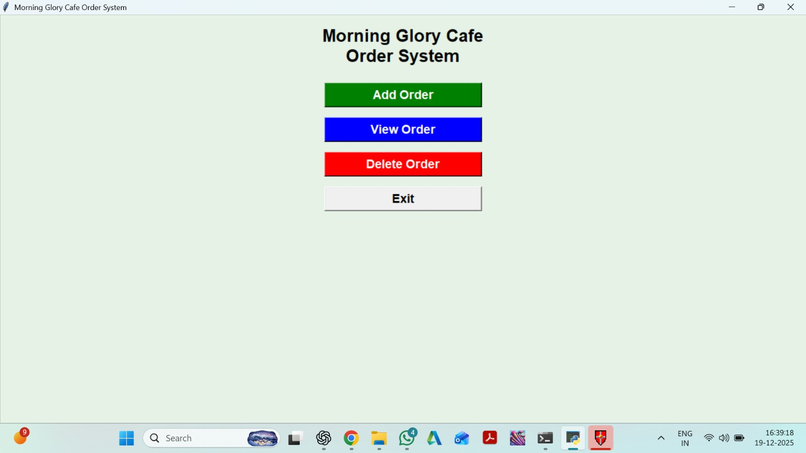

# Morning Glory Cafe Order System ☕

## 📌 Project Description
Morning Glory Cafe Order System is a Python-based desktop application developed using Tkinter.
It helps cafes manage customer orders, calculate bills, and store order details using an SQLite database.

## 🚀 Features
- User-friendly GUI using Tkinter
- Add and manage cafe orders
- Automatic bill calculation
- Data storage using SQLite
- Simple and clean interface

## 🛠 Tech Stack
- Python
- Tkinter (GUI)
- SQLite (Database)

## ▶️ How to Run the Project
1. Clone the repository
2. Make sure Python is installed
3. Run the following command:

```bash
python p1.py


